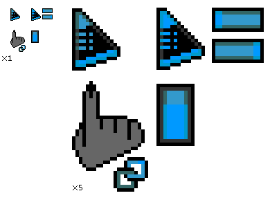

# Ashe Lagomoid Cursor
## Cursor theme for X11

Originally designed for Windows, I no longer need the old .ani format.
### Make from source
Each cursor is meant to be generated with `xcursorgen`.
### Todo
- [ ] Automation script
- [ ] The other cursors
    - [ ] alt
    - [ ] beam
    - [ ] forbidden
    - [ ] hand
    - [ ] help
    - [ ] move
    - [ ] pen
    - [ ] precise
    - [ ] size_EW
    - [ ] size_NeSw
    - [ ] size_NS
    - [ ] size_NwSe
    - [ ] (alternative name symlinks)
